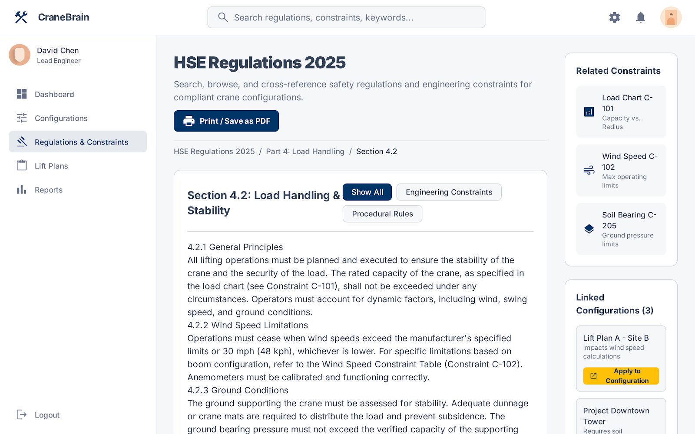
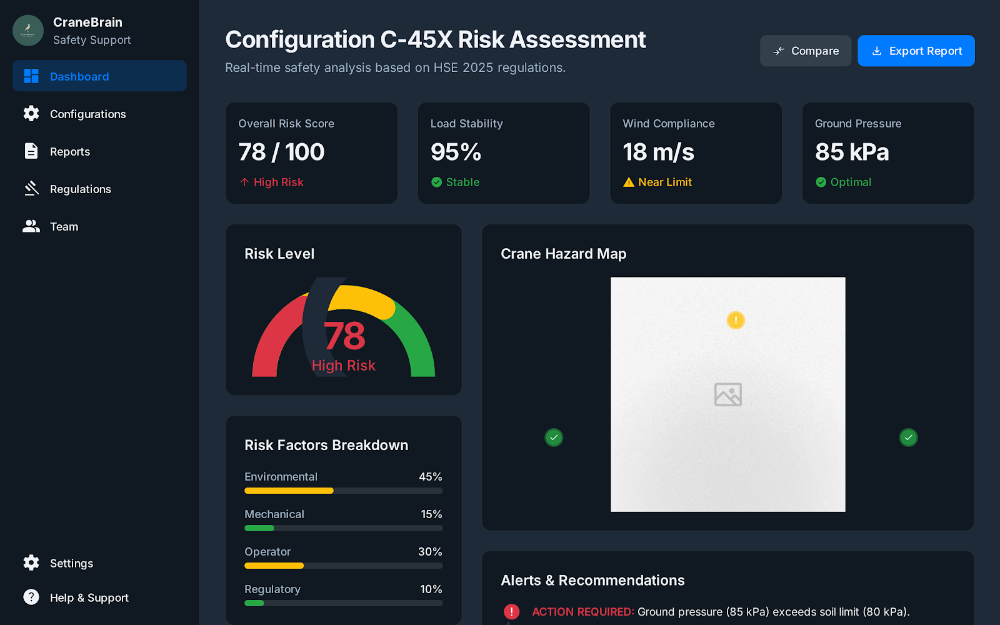
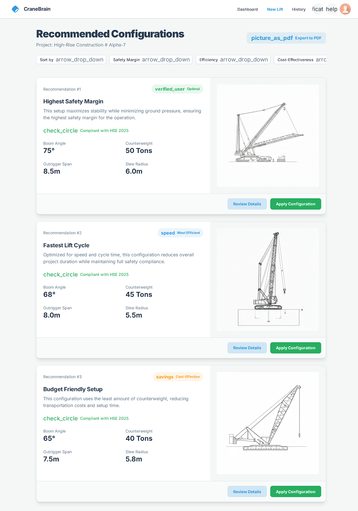
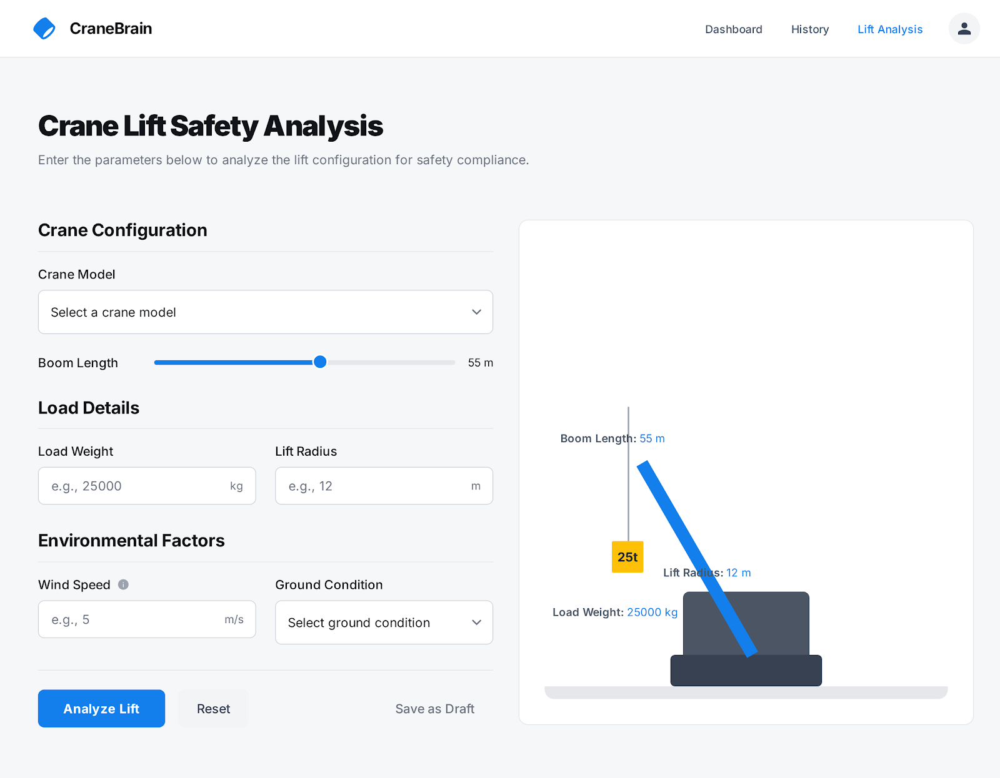

#  CraneBrain – Industrial Crane Safety AI Platform

CraneBrain is an advanced AI-powered safety and risk analysis system for industrial lifting operations.  
It predicts risk using **XGBoost ML models**, ensures **HSE 2025 compliance**, and generates **optimal crane configurations** for safe and efficient lift planning.

---

##  UI Preview

### **HSE Safety Regulations Module**


---

### **Risk Assessment Dashboard**


---

### **Recommended Configurations Engine**


---

### **Lift Analysis Simulator**


---

##  Features

###  AI / ML Features
- XGBoost-based **Risk Classification Model**
- Predicts **Safe / Moderate / High-Risk** lift scenarios
- Smart feature engineering based on:
  - Load capacity  
  - Boom length  
  - Lift radius  
  - Wind tolerance  
  - Speed metrics  

---

### HSE 2025 Compliance Engine
Automatically validates:
- Load charts  
- Swing radius limits  
- Wind speed constraints  
- Ground pressure + soil capacity  
- General lifting safety rules  

---

### Crane Configuration Optimizer
Dynamically generates:
- Highest Stability Setup  
- Fastest Lift Cycle  
- Budget-Friendly Setup  
- Most Efficient Setup  

Based on engineering constraints + ML signals.

---

## Machine Learning Model (XGBoost)

The XGBoost model uses the following dataset fields:

- `Maximum_Load_Capacity`
- `Maximum_Boom_Length`
- `Radius`
- `Wind_Tolerance`
- `Speed`

The model outputs:
- **Risk Label:** Safe / Moderate / High_Risk  
- **Safest Crane Selection** (auto-ranking all cranes)

---

## Dataset Structure

```csv
Model, Type of Crane, Maximum_Load_Capacity_tons, Maximum_Boom_Length_meters, Radius, Wind_Tolerance, Speed
XGC88000, Crawler crane, 3600, 120, 26.34, 23.9, 8.5
XCT50Y, Telescopic crane, 50, 43.3, 34.31, 21.61, 3.17
...
